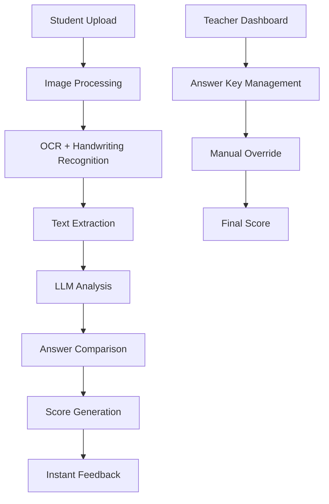

# 🚀 CSU-SmartScore - AI-Powered Quiz Scoring System

<div align="center">


### 🎯 **Intelligent Quiz Scoring with AI-Powered Image Analysis**

*Revolutionize your grading process with automated handwriting recognition and instant feedback!*

[](https://codespaces.new/centmarde/CSU-SmartScore?quickstart=1)
[](https://vercel.com/new/clone?repository-url=https://github.com/centmarde/CSU-SmartScore)

</div>

---

## ✨ **What Makes CSU-SmartScore Special?**

CSU-SmartScore is an **AI-powered quiz scoring system** that revolutionizes the traditional grading process. Using advanced machine learning and image analysis, it automatically evaluates handwritten answers and provides instant feedback to students while giving teachers powerful oversight tools.

### 🧠 **System Workflow**

#### **Student Side:**
1. **📸 Upload Photo** - Students take a photo of their handwritten answer
2. **🚀 AI Analysis** - App sends image to backend → LLM extracts meaning
3. **⚡ Instant Feedback** - LLM compares with answer key and returns score
4. **📊 Results** - Students receive immediate feedback and explanations

#### **Teacher Side:**
1. **📝 Upload Answer Keys** - Teachers input correct answers and scoring rubrics
2. **👀 Monitor Submissions** - View all student submissions and AI-generated scores
3. **🛠️ Override Capability** - Adjust AI grading when needed for fairness
4. **📈 Analytics** - Track student performance and identify learning gaps

---

## 🛠️ **Tech Stack & Architecture**

<table>
<tr>
<td width="50%">

### **Frontend Core**
- **🖼️ Vue 3** - Composition API with `<script setup>`
- **🎨 Vuetify 3** - Material Design components for UI
- **📘 TypeScript** - Full type safety with strict config
- **⚡ Vite** - Lightning-fast dev server & builds
- **🍍 Pinia** - State management for user sessions

</td>
<td width="50%">

### **Backend & AI Services**
- **🧠 LLM Integration** - AI-powered text extraction and analysis
- **📸 Image Processing** - Handwriting recognition from photos
- **� Supabase** - Authentication & database management
- **� RESTful APIs** - Seamless data communication
- **� Real-time Updates** - Instant feedback delivery

</td>
</tr>
</table>

### **🤖 AI-Powered Features**
| Feature | Purpose | Technology |
|---------|---------|------------|
| `Image Recognition` | � **Handwriting Analysis** | Computer Vision + OCR |
| `Answer Comparison` | � **Semantic Matching** | Natural Language Processing |
| `Instant Scoring` | ⚡ **Real-time Grading** | Machine Learning Models |
| `Teacher Override` | 🛠️ **Human-in-the-loop** | Manual Review Interface |
| `Feedback Generation` | � **Personalized Responses** | Large Language Models |

---

## 🏗️ **AI Scoring Architecture**

### **Smart Scoring Pipeline**


### **AI Integration Pattern**
```typescript
// src/controller/scoringController.ts
export function useScoringController() {
  const analyzeAnswer = async (imageFile: File, questionId: string) => {
    // Send image to AI backend
    const extractedText = await extractTextFromImage(imageFile)
    
    // Compare with answer key using LLM
    const score = await compareAnswerWithKey(extractedText, questionId)
    
    // Generate feedback
    const feedback = await generateFeedback(extractedText, score)
    
    return { score, feedback, extractedText }
  }
  
  return { analyzeAnswer }
}
```

---

## 🚀 **Quick Start**

### **Prerequisites**
- Node.js 18+ 
- npm/yarn/pnpm

### **Installation**
```bash
# Clone the repository
git clone https://github.com/centmarde/CSU-SmartScore.git
cd CSU-SmartScore

# Install dependencies
npm install

# Start development server
npm run dev
```

### **Setup Your Scoring System**
1. **📝 Configure Settings**: Modify `public/data/external-page.json`
2. **🎨 Customize Theme**: Update colors and branding
3. **� Setup AI Backend**: Configure LLM endpoints for scoring
4. **📚 Add Answer Keys**: Upload quiz questions and answers
5. **👥 Manage Users**: Set up student and teacher roles

---

## 📁 **Project Structure**

```
src/
├── 📱 components/
│   ├── auth/           # Student/Teacher authentication
│   ├── student/        # Student quiz interface components
│   ├── teacher/        # Teacher dashboard components
│   └── common/         # Shared UI components
├── 🎛️ controller/      # AI scoring & data management
├── 📄 pages/           # Student & teacher pages
├── 🗃️ stores/          # Quiz data & user sessions
├── 🎨 layouts/         # Responsive layout system
├── 🔧 plugins/         # AI service integrations
└── 📚 lib/             # Image processing & scoring utilities

public/
└── 📊 data/
    └── external-page.json  # 🎯 System configuration
```

---

## 💡 **Core Philosophy**

### **🤖 AI-First Education**
- **Intelligent Grading**: AI handles routine scoring tasks
- **Human Oversight**: Teachers maintain final authority
- **Instant Feedback**: Students learn from immediate responses
- **Fair Assessment**: Consistent scoring criteria across all submissions

### **📱 Student-Centered Design**
- **Easy Upload**: Simple photo capture interface
- **Quick Results**: Instant score and feedback delivery
- **Learning Support**: Detailed explanations for improvements
- **Mobile-Friendly**: Works on any device

### **�‍🏫 Teacher Empowerment**
- **Efficient Workflow**: Reduce grading time significantly
- **Quality Control**: Review and adjust AI decisions
- **Analytics Dashboard**: Track student progress patterns
- **Flexible System**: Adaptable to different subjects

---

## 🤝 **Contributing & Future Enhancements**

We welcome contributions to improve CSU-SmartScore! This project aims to:

- **🎓 Transform Education** by automating repetitive grading tasks
- **🤖 Advance AI in Learning** through practical educational applications
- **⚡ Improve Efficiency** for teachers and faster feedback for students
- **🌍 Scale Globally** to support educational institutions worldwide

### **Contribution Areas**
- 🧠 **AI Models**: Improve handwriting recognition accuracy
- 📊 **Analytics**: Enhanced performance tracking and insights
- 🔌 **Integrations**: LMS compatibility (Canvas, Blackboard, etc.)
- 📱 **Mobile Apps**: Native iOS/Android applications
- 🌐 **Localization**: Multi-language support
- 📚 **Subject Expansion**: Support for math equations, diagrams, etc.

---

## 📄 **License**

This project is open source and available under the [MIT License](LICENSE).

---

<div align="center">

**🌟 Star this repo if you believe in the future of AI-powered education!**

[🐛 Report Bug](https://github.com/centmarde/CSU-SmartScore/issues) • [💡 Request Feature](https://github.com/centmarde/CSU-SmartScore/issues) • [💬 Discussions](https://github.com/centmarde/CSU-SmartScore/discussions)

**Built with ❤️ for educators and students everywhere**

</div>